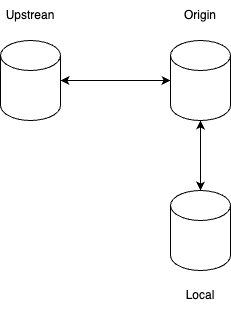

# Fundamental Concepts of Git

## What is Git?

Git is a **distributed version control system**. This means that:
* Every user has a **full copy** of the repository, including all commits and branches. 
* You **don’t need to be connected to a central server** to work—most operations are local.

## What does "distributed" mean in practice?

In a distributed setup, there are typically three levels of repositories:

🔼 upstream

* This is usually the **original project** (often on GitHub or GitLab).
* If you've created a **fork**, the upstream is the **repository you forked from**.
* You don't push to upstream unless you’re a maintainer, but you often fetch updates from it.

🔁 origin

* This is your **remote fork** or the repository you cloned.
* It's where **you push your changes** and often pull from.
* By default, when you clone a repository, Git names it origin.

💻 Local repository

* This is your **personal working copy** on your machine.
* You can commit, branch, merge, and stash locally.
* You sync changes with origin (and possibly upstream) via commands like fetch, pull, and push.

This setup allows you to:

* Contribute to the original project (upstream) by submitting pull requests from your fork (origin)
* Work and experiment locally with full control and history
* Stay up to date with upstream changes using git fetch upstream and git rebase

